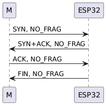
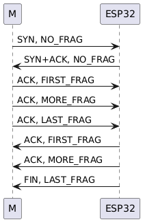

# Bluetooth Communication Protocol


## Table of Contents
- [Bluetooth Communication Protocol](#bluetooth-communication-protocol)
  - [Table of Contents](#table-of-contents)
  - [Overview](#overview)
  - [Protocol Design](#protocol-design)
    - [Message Structure](#message-structure)
    - [Flags](#flags)
  - [Key Functionalities](#key-functionalities)
    - [Message Size Encoding](#message-size-encoding)
    - [Checksum Validation](#checksum-validation)
  - [Communication Workflow](#communication-workflow)
  - [Example Workflow](#example-workflow)
    - [Device Status Request](#device-status-request)
  - [Code Snippets](#code-snippets)
    - [Message Processing](#message-processing)
    - [Exponential Backoff for Retransmissions](#exponential-backoff-for-retransmissions)

---

## Overview

We have designed a robust BLE communication protocol to enable fast, reliable, and secure interaction with devices. The protocol includes the following key features:

- **Data Encapsulation**: Ensures information integrity through modular and structured data transmission.
- **Optimized for Small MTU**: Tailored for efficient communication in environments with limited MTU sizes.
- **Sequence Control**: Ensures ordered and reliable data transmission using serialization mechanisms.
- **Built-in Information Verification**: Enhances communication security and reliability with integrated verification processes.


For a practical implementation, refer to [`ble_tester.py`](../python/ble_tester.py). This file contains the complete implementation of the Bluetooth communication protocol, and you can start your development by editing this Python file.


---

## Protocol Design

### Message Structure

Each message consists of a header and a payload:

```c
typedef struct { // 9 bytes
  uint8_t version;     // Protocol version 0x1 
  uint8_t id;          // Unique ID for each message
  int8_t service;      // Service ID (positive: send, negative: receive)
  uint8_t sequence;    // Sequence number for fragmentation
  uint8_t flags;       // Transmission control flags 
  ble_size_t size;     // Total size of the message payload
  uint8_t checksum;    // Checksum for integrity validation
} BLEHeader;

typedef struct {
  BLEHeader header;
  uint8_t payload[];    // Flexible array for payload data
} Message;
```

### Flags
The flags byte contains information for fragmentation and transmission control:

- Flags (Bits 0–2):

  * 0x0: NONE
  * 0x1: SYN (connection request)
  * 0x2: ACK (acknowledgment)
  * 0x3: FIN (termination request)
  * 0x4: RST (reset connection)
  * 0x5: SYN+ACK (connection acknowledgment)

- Fragmentation Flags (Bits 3–4):

  * 0x0: No fragment
  * 0x1: First fragment
  * 0x2: More fragments
  * 0x3: Last fragment

## Key Functionalities
### Message Size Encoding
ble_size_t is a 3-byte structure used to encode and decode the payload size efficiently:

```c
typedef struct {
    uint8_t bytes[3];
} ble_size_t;

// Convert `ble_size_t` to `uint32_t`
uint32_t get_ble_size_t(ble_size_t b) {
    uint32_t result = 0;
    result |= ((uint32_t)b.bytes[0]) << 16;
    result |= ((uint32_t)b.bytes[1]) << 8;
    result |= ((uint32_t)b.bytes[2]);
    return result;
}

// Convert `uint32_t` to `ble_size_t`
ble_size_t set_ble_size_t(uint32_t value) {
    ble_size_t b;
    b.bytes[0] = (value >> 16) & 0xFF;
    b.bytes[1] = (value >> 8) & 0xFF;
    b.bytes[2] = value & 0xFF;
    return b;
}
```
### Checksum Validation
The checksum field ensures message integrity:

```cpp
uint8_t calcChecksum(BLEHeader *header) {
    const uint8_t *begin = reinterpret_cast<const uint8_t *>(header);
    const uint8_t *end = begin + sizeof(BLEHeader) - 1; // Exclude checksum byte
    return std::accumulate(begin, end, static_cast<uint8_t>(0));
}

bool validateChecksum(BLEHeader *header) {
    uint8_t expected_checksum = header->checksum;
    header->checksum = 0;
    uint8_t calculated_checksum = calcChecksum(header);
    header->checksum = expected_checksum;
    return calculated_checksum == expected_checksum;
}
```

## Communication Workflow





1. Handshake (Connection Establishment)
Sender:
Sends a SYN packet with the requested service ID and optional payload.
Receiver:
Processes the payload and responds with a SYN+ACK packet.
This process reduces the usual three-way handshake to two steps for efficiency.

2. Data Exchange
For large data, use fragmentation (FRAG FLAGS):
First fragment: 0x1
More fragments: 0x2
Last fragment: 0x3
Receiver acknowledges (ACK) each received packet.
3. Connection Termination
Sender:
Sends a FIN packet, optionally with a final payload.
Receiver:
Processes the payload and responds with an ACK.
This simplified termination avoids the traditional four-step handshake, making the process faster.

## Example Workflow
### Device Status Request
1. Sender: Sends SYN requesting the device status.
2. Receiver: Responds with SYN+ACK, providing the current status.
3. Sender: Sends additional configuration requests.
4. Receiver: Responds with a FIN packet after completing the operation.
5. Sender: Acknowledges the FIN with an ACK.

## Code Snippets
### Message Processing
``` cpp
void process_message(Message &msg, IMessageHandler &handler) {
    ESP_LOGD(TAG, "Processing message with ID: %d", msg.getID());
    uint8_t flags = msg.getFlags() & 0x7;
    uint8_t frag_flags = (msg.getFlags() >> 3) & 0x3;

    switch (flags) {
        case SYN:
            handler.handle_syn(msg);
            break;
        case SYN_ACK:
            handler.handle_syn_ack(msg);
            break;
        case ACK:
            handler.handle_ack(msg);
            break;
        case FIN:
            handler.handle_fin(msg);
            break;
    }
}
```
### Exponential Backoff for Retransmissions
```cpp
const int backoff_intervals[] = {128, 256, 512, 1024, 2048, 4096};

void retransmit_message(Message &msg, int retry_count) {
    if (retry_count >= sizeof(backoff_intervals) / sizeof(backoff_intervals[0])) {
        ESP_LOGE(TAG, "Maximum retries reached");
        return;
    }
    int backoff = backoff_intervals[retry_count];
    ESP_LOGI(TAG, "Retransmitting message with backoff: %d ms", backoff);
    vTaskDelay(backoff / portTICK_PERIOD_MS);
    send_message(msg); // Assume send_message() handles actual transmission
}
```